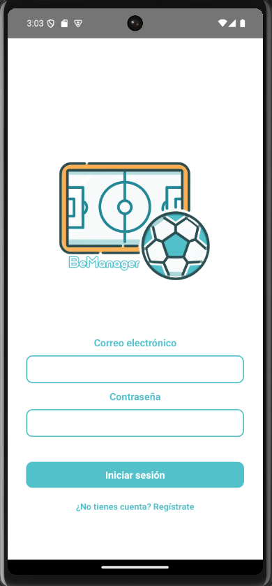
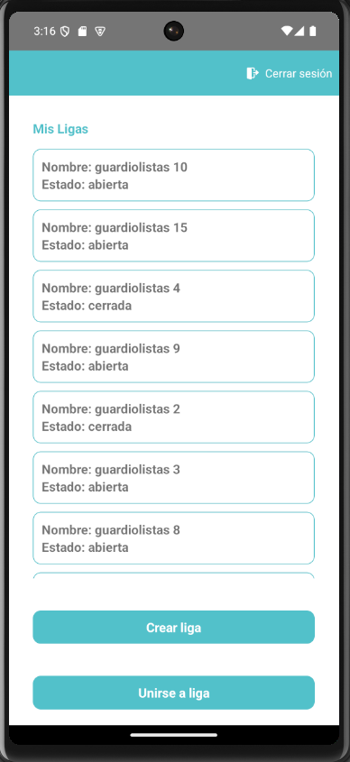
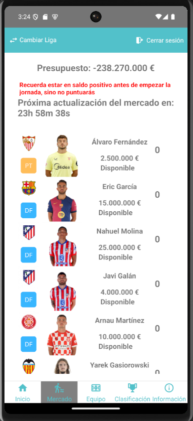
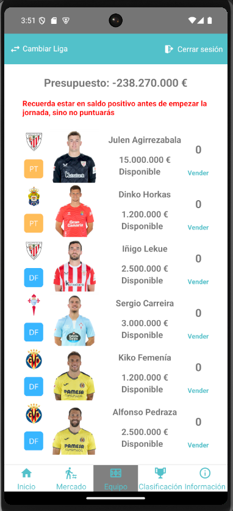
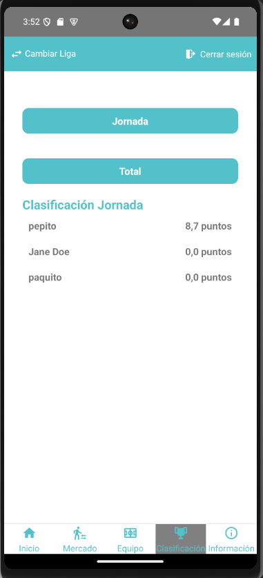
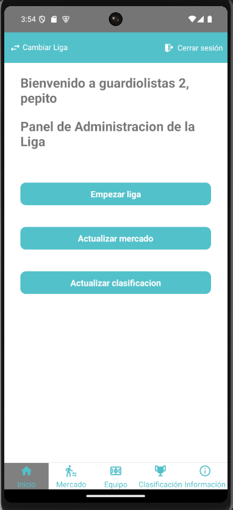
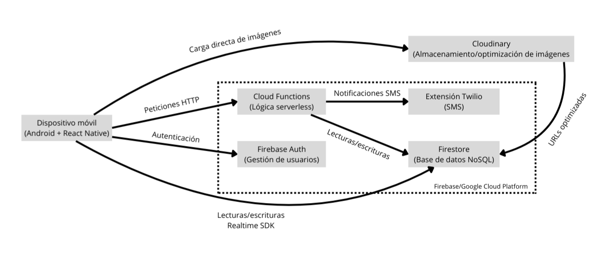

# BeManager — Fantasy de fútbol móvil (React Native + Firebase)

> Aplicación móvil cliente-servidor para gestión de ligas deportivas con datos sincronizados en tiempo real.
> Frontend en **React Native**, backend **serverless** con **Firebase/Cloud Functions**, media en **Cloudinary** y SMS con **Twilio**.


---

## 👨‍💻 Mi participación

Proyecto desarrollado íntegramente por mí como Trabajo Fin de Grado.

Me encargué de:
- Diseño de la arquitectura cliente-servidor
- Implementación del frontend móvil en React Native
- Desarrollo del backend en Cloud Functions
- Modelado de la base de datos en Firestore
- Integración de servicios externos (Cloudinary y Twilio)
- Pruebas y depuración de la aplicación

---

## 📱 Capturas

| Login                          | Ligas                               | Mercado                         |
|--------------------------------|-------------------------------------|---------------------------------|
|  |  |  |

| Equipo                         | Clasificación                      | Perfil                         |
|--------------------------------|------------------------------------|--------------------------------|
|  |  |  |

---

## ✨ Características

- Registro/inicio de sesión con **Firebase Auth**
- Creación y unión a **ligas privadas** (código de invitación)
- **Mercado de fichajes** con pujas y resolución por administrador
- **Clasificación** parcial y total; reparto de **recompensas**
- **Plantilla** del usuario con venta de jugadores
- Consulta de **ligas reales**, equipos y jugadores
- **Sincronización** eficiente con **React Query**
- Gestión de **imágenes** (avatares/escudos) vía **Cloudinary**
- **SMS** (extensión Firebase + Twilio) para notificaciones puntuales

---

## 🧩 Retos técnicos

Durante el desarrollo surgieron varios problemas típicos de aplicaciones cliente-servidor:

- Sincronización de datos entre múltiples usuarios en tiempo real
- Evitar inconsistencias en el mercado de fichajes al realizar pujas simultáneas
- Gestión de estado de usuario tras autenticación
- Minimizar llamadas innecesarias al backend

### Soluciones aplicadas
- Uso de React Query para cacheo y revalidación automática
- Lógica crítica trasladada a Cloud Functions para evitar manipulación desde cliente
- Uso de Context API para estado global de usuario y ligas
- Separación de responsabilidades entre frontend y backend

---

## 🧱 Arquitectura (resumen)

- **App móvil (React Native)**
    - UI (React Native + React Navigation)
    - Estado/Datos (React Query + hooks)
    - Cliente HTTP (Axios) → Cloud Functions
- **Backend serverless (Firebase/GCP)**
    - Auth, Firestore, Cloud Functions (HTTP/Callable y triggers)
    - Extensión Twilio (envío SMS)
- **Servicios externos**
    - Cloudinary (almacenamiento/transformación de imágenes)



### Decisiones de diseño

- Firestore no es accesible directamente desde el cliente; todas las operaciones críticas pasan por Cloud Functions para evitar manipulación de datos.
- La lógica del mercado de fichajes se ejecuta en backend para evitar inconsistencias en pujas simultáneas.
- React Query se utiliza para cacheo y sincronización eficiente entre cliente y servidor.
- Cloudinary se usa para descargar carga de almacenamiento y optimizar imágenes.

---

## 🧰 Stack técnico

- **Frontend:** React Native, React Navigation, Axios, React Query, react-native-image-picker, uuid  
- **Backend:** Firebase Auth, Firestore, Cloud Functions  
- **Calidad:** ESLint, Prettier, Jest, React Native Testing Library  
- **Herramientas:** Node.js, npm, Android Studio, WebStorm
- **Otros:** Cloudinary, Twilio (Firebase Extension), Crypto-es

---

## 📦 Estructura del proyecto

- `/app` → Aplicación móvil (React Native)
- `/functions` → Backend serverless (Firebase Cloud Functions)

---

## 🚀 Ejecutar el proyecto localmente (resumen)

### 1) Clonar repositorio

### 2) Configurar credenciales Firebase

### 3) npm install

### 4) npm run android

---

## 🧪 Pruebas

**Unitarias (frontend)** — Jest + React Native Testing Library
```bash
# desde root/app
npm run test
```

**Integración / Sistema**:
- Autenticación, creación/unión a liga, mercado (pujas/resolución), clasificación y recompensas.
- Verificación en Firestore Console y logs de Cloud Functions.

---

## 🗃️ Datos iniciales
Para poblar ligas/equipos/jugadores:
- Scripts Node.js o importación JSON a Firestore siguiendo la estructura del Diseño Físico de Datos.

---

## 🔐 Seguridad
- Firestore cerrado al cliente; el acceso se realiza mediante Cloud Functions
- Tokens de Auth gestionados por Firebase Auth
- URLs de Cloudinary firmadas/seguras cuando proceda
- Nunca subas claves/JSON privados al repo (usa `.gitignore`)

---

## 🗺️ Roadmap

- Cobertura de pruebas en backend
- Optimización de rendimiento (mercado y clasificación)
- Internacionalización (i18n)
- Funciones sociales y nuevas competiciones

---

## 📄 Licencias

- **Código:** [MIT License]
- **Memoria:** [CC BY-NC-SA 4.0]

---

## 📚 Qué aprendí

Durante este proyecto aprendí principalmente:

- Diseño de APIs y separación frontend/backend
- Gestión de estado en aplicaciones móviles
- Uso de servicios cloud en aplicaciones reales
- Implementación de lógica de negocio en backend serverless
- Integración de servicios externos (Cloudinary, Twilio)
- Depuración y mantenimiento de un proyecto grande

Este proyecto marcó mi transición de aprender programación a desarrollar software funcional.

---
